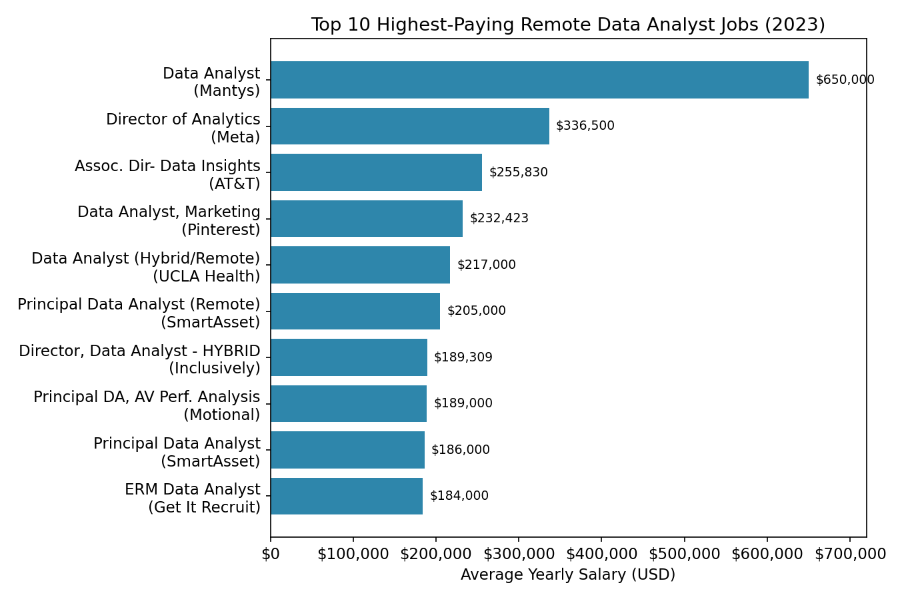
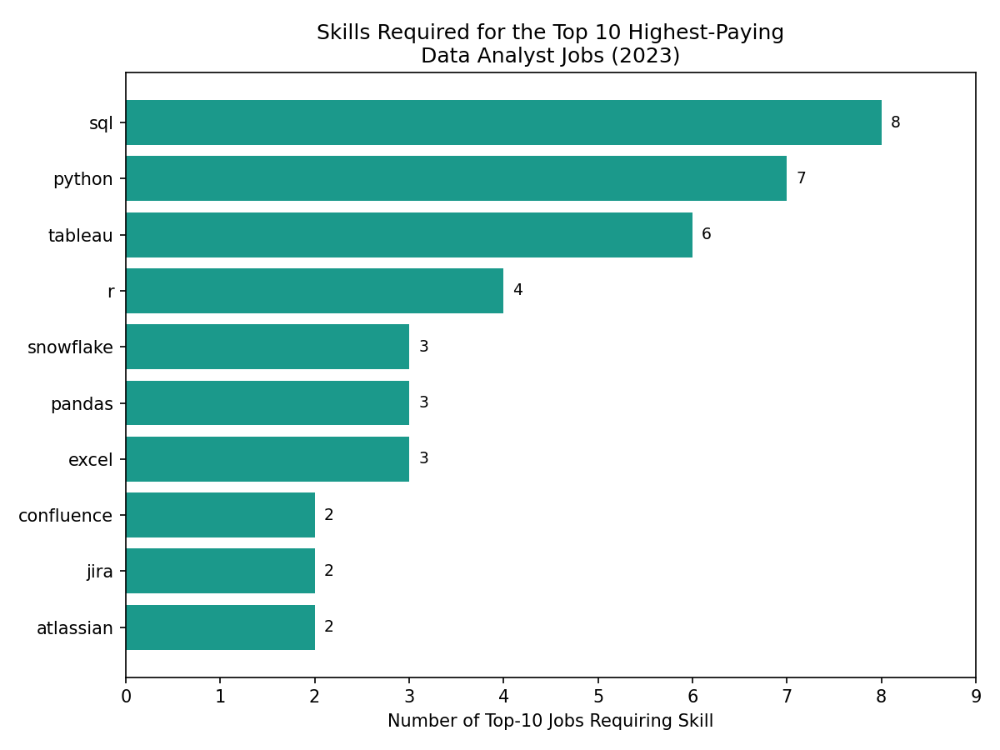
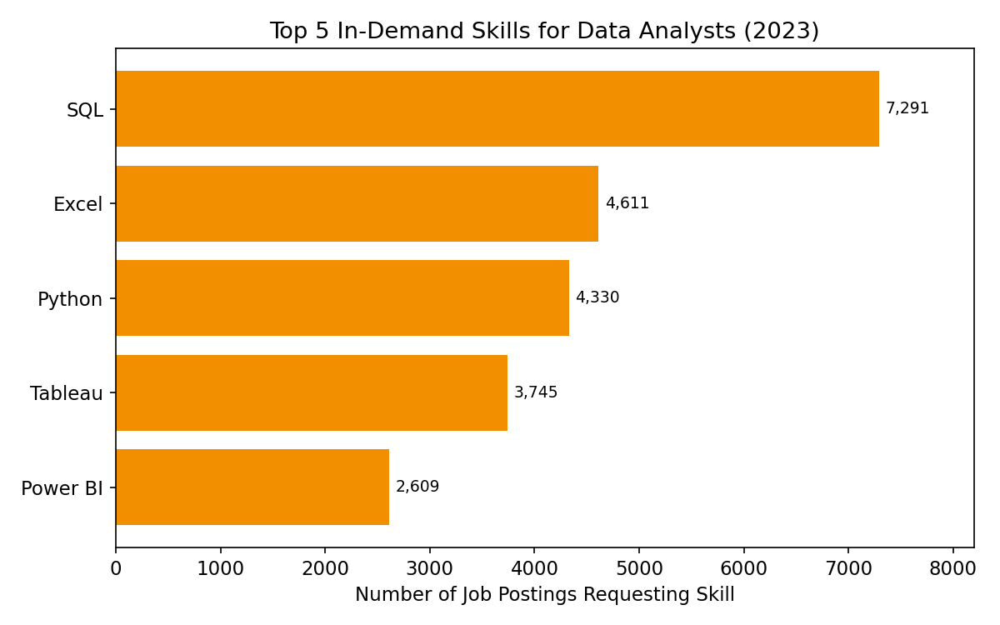
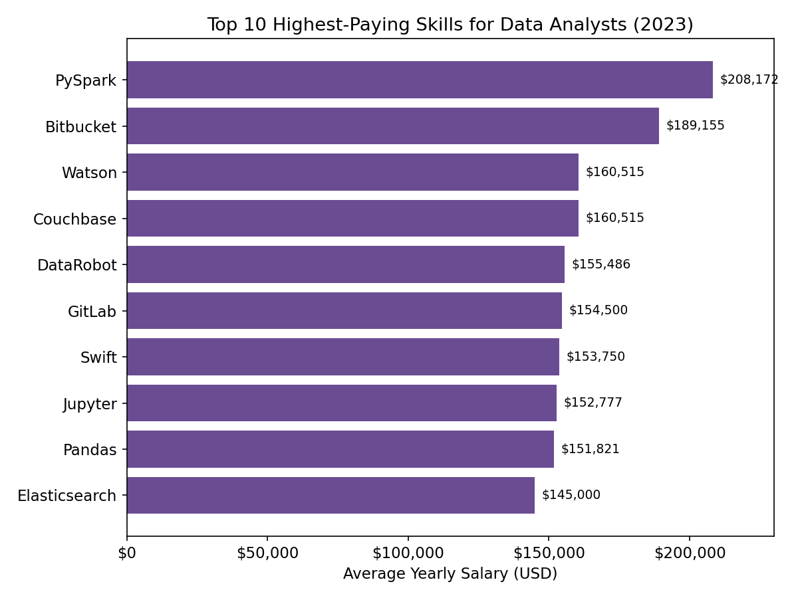
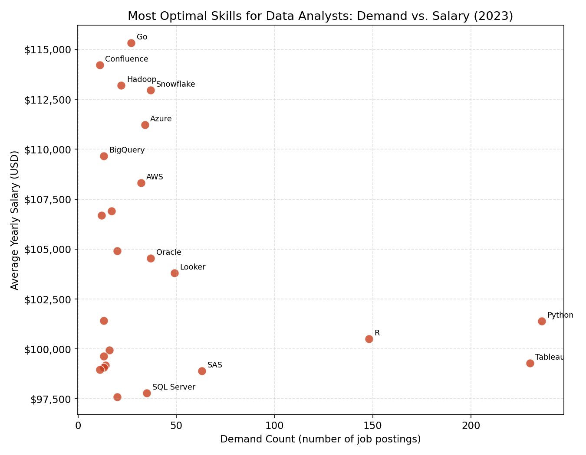

# Introduction 📊
Dive into the data job market! This project focuses on Data Analyst roles, exploring 💰 top-paying jobs, 🔥 in-demand skills, and 📈 where high demand meets high salary in data analytics.

SQL queries? Check them out here: [project_sql folder](/project_sql/)

# Background
Driven by a quest to navigate the data analyst job market more effectively, this project was born from a desire to pinpoint top-paid and in-demand skills, streamlining others' work to find optimal jobs.

Data comes from a job postings dataset, packed with details on job titles, salaries, locations, and essential skills. CSV files for the dataset are available here: [Google Drive folder](https://drive.google.com/drive/folders/14ci2JHMRWfa8kX6_TZHvBYlhMI5Sayyq?usp=drive_link)

### The questions I wanted to answer through my SQL queries were:

1. What are the top-paying data analyst jobs?
2. What skills are required for these top-paying jobs?
3. What skills are most in demand for data analysts?
4. Which skills are associated with higher salaries?
5. What are the most optimal skills to learn?

# Tools I Used
For my deep dive into the data analyst job market, I harnessed the power of several key tools:

- **SQL:** The backbone of my analysis, allowing me to query the database and unearth critical insights.
- **PostgreSQL:** The chosen database management system, ideal for handling the job posting data.
- **Visual Studio Code:** My go-to for database management and executing SQL queries.
- **Git & GitHub:** Essential for version control and sharing my SQL scripts and analysis, ensuring collaboration and project tracking.

# The Analysis
Each query for this project aimed at investigating specific aspects of the data analyst job market. Here's how I approached each question:

### 1. Top Paying Data Analyst Jobs
To identify the highest-paying roles, I filtered data analyst positions by average yearly salary and location, focusing on remote jobs.

```sql
SELECT	
	job_id,
	job_title,
	job_location,
	job_schedule_type,
	salary_year_avg,
	job_posted_date,
    name AS company_name
FROM
    job_postings_fact
LEFT JOIN company_dim ON job_postings_fact.company_id = company_dim.company_id
WHERE
    job_title_short = 'Data Analyst' AND 
    job_location = 'Anywhere' AND 
    salary_year_avg IS NOT NULL
ORDER BY
    salary_year_avg DESC
LIMIT 10;
```

Here's the breakdown of the top data analyst jobs in 2023:

- **Wide salary range:** Top 10 paying roles span from $184,000 to $650,000, indicating significant salary potential in the field.
- **Diverse employers:** Companies like SmartAsset, Meta, and AT&T are among those offering high salaries, showing broad interest across different industries.
- **Job title variety:** There's a high diversity in job titles, from Data Analyst to Director of Analytics, reflecting varied roles and specializations within data analytics.

### 2. Skills for Top Paying Jobs
To understand what skills are required for the top-paying jobs, I joined the job postings with the skills data, providing insights into what employers value for high-compensation roles.

```sql
WITH top_paying_jobs AS (
    SELECT	
        job_id,
        job_title,
        salary_year_avg,
        name AS company_name
    FROM
        job_postings_fact
    LEFT JOIN company_dim ON job_postings_fact.company_id = company_dim.company_id
    WHERE
        job_title_short = 'Data Analyst' AND 
        job_location = 'Anywhere' AND 
        salary_year_avg IS NOT NULL
    ORDER BY
        salary_year_avg DESC
    LIMIT 10
)

SELECT 
    top_paying_jobs.*,
    skills
FROM top_paying_jobs
INNER JOIN skills_job_dim ON top_paying_jobs.job_id = skills_job_dim.job_id
INNER JOIN skills_dim ON skills_job_dim.skill_id = skills_dim.skill_id
ORDER BY
    salary_year_avg DESC;
```

Breakdown of the most demanded skills for the top 10 highest paying data analyst jobs:

- **SQL** is the clear leader, required in 8 of the top 10 highest-paying roles, confirming it as the single most critical skill for landing a top-paying data analyst job.
- **Python** (7 of 10) and **Tableau** (6 of 10) follow closely behind, reinforcing that programming and data visualization skills are near-essential at the top of the pay scale.
- **R**, **Snowflake**, **Pandas**, and **Excel** also show up repeatedly, while niche collaboration/DevOps tools (**Jira**, **Confluence**, **Atlassian**, **Bitbucket**) appear in a couple of the more senior/director-level postings, hinting that those roles blend analyst work with cross-team engineering collaboration.

### 3. In-Demand Skills for Data Analysts
This query helped identify the skills most frequently requested in job postings, directing focus to areas with high demand.

```sql
SELECT 
    skills,
    COUNT(skills_job_dim.job_id) AS demand_count
FROM job_postings_fact
INNER JOIN skills_job_dim ON job_postings_fact.job_id = skills_job_dim.job_id
INNER JOIN skills_dim ON skills_job_dim.skill_id = skills_dim.skill_id
WHERE
    job_title_short = 'Data Analyst' 
    AND job_work_from_home = True 
GROUP BY
    skills
ORDER BY
    demand_count DESC
LIMIT 5;
```

Here's the breakdown of the most demanded skills for data analysts in 2023:

- **SQL** and **Excel** remain fundamental, emphasizing the need for strong foundational skills in data processing and spreadsheet manipulation.
- **Python**, **Tableau**, and **Power BI** are essential, pointing towards the growing importance of programming and data visualization tools for storytelling and decision support.

### 4. Skills Based on Salary
Exploring the average salaries associated with different skills revealed which skills are the highest paying.

```sql
SELECT 
    skills,
    ROUND(AVG(salary_year_avg), 0) AS avg_salary
FROM job_postings_fact
INNER JOIN skills_job_dim ON job_postings_fact.job_id = skills_job_dim.job_id
INNER JOIN skills_dim ON skills_job_dim.skill_id = skills_dim.skill_id
WHERE
    job_title_short = 'Data Analyst'
    AND salary_year_avg IS NOT NULL
    AND job_work_from_home = True 
GROUP BY
    skills
ORDER BY
    avg_salary DESC
LIMIT 25;
```

Here's a breakdown of the results for top-paying skills for data analysts:

- **Big data & ML tools dominate:** Skills like **PySpark** ($208K) and **DataRobot** ($155K) top the list, reflecting the premium placed on big data processing and machine learning capabilities.
- **Software development & deployment tools:** Familiarity with **GitLab**, **Bitbucket**, and **Kubernetes** points to strong pay for skills that overlap with engineering and DevOps, blurring the line between data analysis and data engineering.
- **Cloud & data engineering skills:** Proficiency in tools like **Elasticsearch**, **Databricks**, and **GCP** reflects the growing importance and high compensation for cloud-based analytics environments.

### 5. Most Optimal Skills to Learn
Combining insights from demand and salary data, this query aimed to pinpoint skills that are both in high demand and have high salaries, offering a strategic focus for skill development.

```sql
SELECT 
    skills_dim.skill_id,
    skills_dim.skills,
    COUNT(skills_job_dim.job_id) AS demand_count,
    ROUND(AVG(job_postings_fact.salary_year_avg), 0) AS avg_salary
FROM job_postings_fact
INNER JOIN skills_job_dim ON job_postings_fact.job_id = skills_job_dim.job_id
INNER JOIN skills_dim ON skills_job_dim.skill_id = skills_dim.skill_id
WHERE
    job_title_short = 'Data Analyst'
    AND salary_year_avg IS NOT NULL
    AND job_work_from_home = True 
GROUP BY
    skills_dim.skill_id
HAVING
    COUNT(skills_job_dim.job_id) > 10
ORDER BY
    avg_salary DESC,
    demand_count DESC
LIMIT 25;
```

Here's a breakdown of the most optimal skills for data analysts in 2023:

- **High-demand programming languages:** **Python** and **R** stand out for their high demand (236 and 148 mentions respectively), with average salaries around $101K and $100K — proof that even widely-used skills can pay well when demand is this high.
- **Cloud tools grow in importance:** Skills in cloud and big-data tools like **Azure**, **AWS**, and **Snowflake** show notable demand alongside strong salaries (all above $108K), reflecting the growing importance of cloud platforms in data analytics.
- **BI & visualization tools matter:** **Tableau** and **Looker**, with strong demand counts (230 and 49) and solid average salaries (~$99K and ~$104K), highlight the continued importance of data visualization and BI skills for driving business decisions from data.

# What I Learned
Throughout this project, I deepened my understanding of the data analyst job market and honed my SQL skills:

- **🧩 Complex Query Crafting:** Mastered joining multiple tables and using `WITH` clauses for temp tables.
- **📊 Data Aggregation:** Got comfortable with `GROUP BY`, and used aggregate functions like `COUNT()` and `AVG()`.
- **💡 Analytical Wizardry:** Leveled up my real-world problem-solving skills, turning questions into actionable, insightful SQL queries.

# Conclusions

### Insights
From the analysis, several general insights emerged:

1. **Top-Paying Data Analyst Jobs:** Remote data analyst roles offer a huge salary range, with the highest reaching $650,000, showing strong earning potential in the field.
2. **Skills for Top-Paying Jobs:** SQL is required in 8 of the top 10 highest-paying roles, with Python and Tableau close behind — confirming these three as the highest-leverage skills for reaching the top of the salary scale.
3. **Most In-Demand Skills:** SQL is also the most demanded skill in the data analyst job market, making it essential for job seekers.
4. **Skills with Higher Salaries:** Specialized skills such as PySpark and Bitbucket are associated with the highest average salaries, indicating a premium on niche, technical expertise.
5. **Optimal Skills for Job Market Value:** SQL, Python, and R lead in demand and offer competitive salaries, positioning them among the most optimal skills for analysts to learn in order to maximize market value.

### Closing Thoughts
This project enhanced my SQL skills and provided valuable insights into the data analyst job market. The findings from the analysis serve as a guide to prioritizing skill development and job search efforts. Aspiring data analysts can better position themselves in a competitive job market by focusing on high-demand, high-salary skills.
